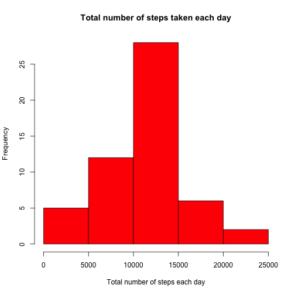
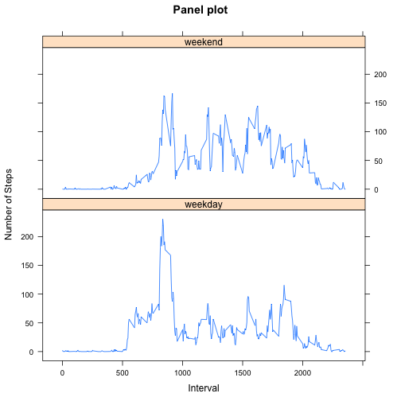

Using data from a personal activity monitoring device
========================================================

### Description:
**This assignment makes use of data from a personal activity monitoring device. This device collects data at 5 minute intervals through out the day. The data consists of two months of data from an anonymous individual collected during the months of October and November, 2012 and include the number of steps taken in 5 minute intervals each day.**

 
### Step 1: Reading data from csv file

```r

activity <- read.csv("activity.csv", sep = ",")
```


### Question 1: What is mean total number of steps taken per day?


For this part of the assignment, you can ignore the missing values in the dataset.


```r

# Clean NA´s values from the dataset
activity_clean <- activity[!is.na(activity[, "steps"]), ]
```


Make a histogram of the total number of steps taken each day


```r

# Calculate the total number of steps per day
total_steps_per_day <- aggregate(as.numeric(as.character(activity_clean$steps)), 
    by = list(activity_clean$date), FUN = sum)

colnames(total_steps_per_day) <- c("date", "num_steps")

# Histogram with the total number of steps taken each day
hist(as.numeric(total_steps_per_day$num_steps), xlab = "Total number of steps each day", 
    col = "red", main = "Total number of steps taken each day")
```

 


Calculate and report the mean and median total number of steps taken per day


```r
# Get the mean and median total number of steps taken per day
mean_val <- mean(total_steps_per_day$num_steps)

median_val <- median(total_steps_per_day$num_steps)

print(mean_val)  #10766.19
```

```
## [1] 10766
```

```r

print(median_val)  #10765
```

```
## [1] 10765
```


### Question 2: What is the average daily activity pattern?

Make a time series plot (i.e. type = "l") of the 5-minute interval (x-axis) and the average number of steps taken, averaged across all days (y-axis)


```r

# Calculate the average number of steps taken across all days
avg_steps_days <- aggregate(as.numeric(as.character(activity_clean$steps)), 
    by = list(activity_clean$interval), FUN = mean)

colnames(avg_steps_days) <- c("interval", "avg_steps")

# Plot with the avg number of steps taken across all days
plot(avg_steps_days$interval, avg_steps_days$avg_steps, type = "l", xlab = "5_min_interval", 
    ylab = "avg_across_days", main = "average number of steps taken across all days")
```

 


Which 5-minute interval, on average across all the days in the dataset, contains the maximum number of steps?


```r

# Sort the avg_steps values from higher to lower
max_num_of_steps <- avg_steps_days[with(avg_steps_days, order(-avg_steps_days$avg_steps)), 
    ]

# The first row will be the higher
high_value <- max_num_of_steps[1, "interval"]

print(high_value)  #835
```

```
## [1] 835
```


### Question 3: Imputing missing values

Note that there are a number of days/intervals where there are missing values (coded as NA). The presence of missing days may introduce bias into some calculations or summaries of the data.

Calculate and report the total number of missing values in the dataset (i.e. the total number of rows with NAs)


```r

# The dataset just has na values on the 'steps' column

# Get the na values
na_steps <- activity[is.na(activity[, "steps"]), ]

print(nrow(na_steps))  #2304
```

```
## [1] 2304
```


Devise a strategy for filling in all of the missing values in the dataset. The strategy does not need to be sophisticated. For example, you could use the mean/median for that day, or the mean for that 5-minute interval, etc.

Create a new dataset that is equal to the original dataset but with the missing data filled in.

**Strategy selected: we are going to fill the na values with the mean value for each 5-minute interval. Since type of mean values is double, it is neccesary to round them to get an integer value (it is not reasonable having i.e. 3,421 steps one day)**


```r

# Fill in all of the missing values in the dataset. The strategy selected is
# use the mean value for each 5-minute interval

# We can merge both na_steps and avg_steps_days dataset and fill the na
# value in the first dataset with the mean value in the second.
na_steps <- merge(na_steps, avg_steps_days, by.na_steps = "interval", by.avg_steps_days = "interval", 
    all = TRUE)

# Order the resultant dataset by date
na_steps <- na_steps[with(na_steps, order(na_steps$date)), ]

# Fill the na`s column (interval) with the avg_steps value rounded to int
na_steps$steps <- round(na_steps$avg_steps, 0)

# Delete unnecesary columns
na_steps <- subset(na_steps, select = c("interval", "steps", "date"))

# Add mean values for the na`s in the original dataset (activity) merge both
# dataset
activity2 <- merge(x = activity, y = na_steps, by = c("date", "interval"), all.x = TRUE)

# identify na rows
na_rows <- is.na(activity2[, "steps.x"])

# fill na values with mean values for the na rows
activity2[na_rows, "steps.x"] <- activity2[na_rows, "steps.y"]

activity2 <- subset(activity2, select = c("steps.x", "date", "interval"))
colnames(activity2) <- c("steps", "date", "interval")
```


Make a histogram of the total number of steps taken each day and Calculate and report the mean and median total number of steps taken per day. 


```r

# Calculate the total number of steps per day
total_steps_per_day1 <- aggregate(as.numeric(as.character(activity2$steps)), 
    by = list(activity$date), FUN = sum)

colnames(total_steps_per_day1) <- c("date", "num_steps")

# Histogram with the total number of steps taken each day
hist(as.numeric(total_steps_per_day1$num_steps), xlab = "Total number of steps each day", 
    col = "orange", main = "Total number of steps taken each day")
```

 

```r

# Get the mean and median total number of steps taken per day
mean_val1 <- mean(total_steps_per_day1$num_steps)

median_val1 <- median(total_steps_per_day1$num_steps)

print(mean_val1)  #10765.64
```

```
## [1] 10766
```

```r

print(median_val1)  #10762
```

```
## [1] 10762
```


Do these values differ from the estimates from the first part of the assignment? 

- Mean values are equals but median values are different.

What is the impact of imputing missing data on the estimates of the total daily number of steps?

- Mean and median are going to be different because of the number of elements.

### Question 4: Are there differences in activity patterns between weekdays and weekends?

For this part the weekdays() function may be of some help here. Use the dataset with the filled-in missing values for this part.

Create a new factor variable in the dataset with two levels - "weekday" and "weekend" indicating whether a given date is a weekday or weekend day.


```r

# Cast to date
activity2$date <- as.Date(activity2$date)

activity2$day <- ifelse(weekdays(activity2$date) == "sábado" | weekdays(activity2$date) == 
    "domingo", "weekend", "weekday")
```


Make a panel plot containing a time series plot (i.e. type = "l") of the 5-minute interval (x-axis) and the average number of steps taken, averaged across all weekday days or weekend days (y-axis).


```r

# Calculate the number of steps per day of week (dow)
total_steps_per_dow <- aggregate(as.numeric(as.character(activity2$steps)), 
    by = list(activity$interval, activity2$day), FUN = mean)

# Set column names
colnames(total_steps_per_dow) <- c("interval", "day", "num_steps")

# Generate the panel plot
xyplot(num_steps ~ interval | day, data = total_steps_per_dow, layout = c(1, 
    2), type = "l", ylab = "Number of Steps", xlab = "Interval", main = "Panel plot")
```

 


